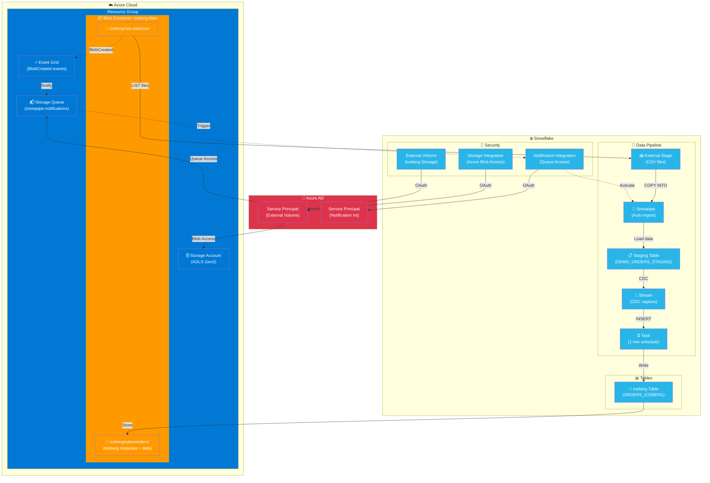
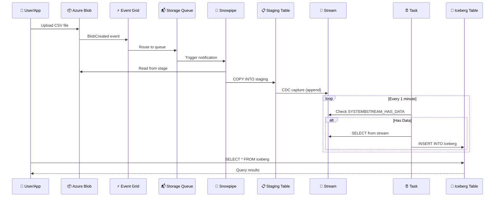
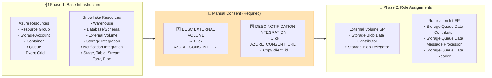

# Snowflake Iceberg Lakehouse on Azure

&nbsp;&nbsp;&nbsp;

A production-ready implementation of Apache Iceberg tables on Azure Blob Storage with Snowflake, fully automated with Terraform and GitHub Actions.

## Overview

This repository provides a complete data lakehouse solution featuring:

- **Apache Iceberg Tables**: Open table format for analytics on Azure Blob Storage
- **Snowflake Integration**: Query Iceberg tables using Snowflake's external catalog
- **Infrastructure as Code**: Terraform configurations for Azure and Snowflake resources
- **Automated Data Pipeline**: Snowpipe → Staging Table → Stream → Task → Iceberg Table
- **CI/CD Ready**: Two-phase GitHub Actions deployment with manual consent step

## Architecture



## Data Flow



## Two-Phase Deployment



## Repository Structure

```
.
├── infra/
│   ├── platform/tf/           # Root orchestration module (entry point)
│   │   ├── main.tf            # Orchestrates Azure + Snowflake + Role Assignments
│   │   ├── locals.tf          # Configuration parsing from JSON
│   │   ├── variables.tf       # Input variables (incl. deployment_phase)
│   │   ├── outputs.tf         # Module outputs
│   │   ├── providers-azure.tf # Azure + AzureAD provider config
│   │   ├── providers-snowflake.tf
│   │   └── terraform.tfvars   # Variable values
│   ├── azure/tf/              # Azure child module
│   │   ├── main.tf            # Resource Group, Storage, Queue, Event Grid
│   │   └── modules/           # Nested modules (resource_group, storage_account, storage_container)
│   └── snowflake/tf/          # Snowflake child module
│       ├── main.tf            # Warehouses, databases, stages, pipes, streams, tasks
│       └── modules/           # Nested modules (external_volume, stream, task)
├── input-jsons/
│   ├── azure/config.json      # Azure resource configuration
│   └── snowflake/config.json  # Snowflake resource configuration
├── sample-data/               # Sample CSV files for testing
├── snowflake-ddl/             # Snowflake DDL Scripts (reference)
└── .github/workflows/         # GitHub Actions workflows
```

## Getting Started

### Prerequisites

- **Terraform** >= 1.14
- **Azure CLI** with active subscription
- **Snowflake Account** with ACCOUNTADMIN access
- **GitHub Repository** (for CI/CD)

### Quick Start (Local)

#### 1. Clone and Configure

```bash
git clone <repository-url>
cd <repository>

# Update configuration files
# - input-jsons/azure/config.json
# - input-jsons/snowflake/config.json
# - infra/platform/tf/terraform.tfvars
```

#### 2. Authenticate

```bash
# Azure
az login

# Snowflake (set private key)
export SNOWFLAKE_PRIVATE_KEY=$(cat path/to/snowflake_key.p8)
```

#### 3. Phase 1 Deployment

```bash
cd infra/platform/tf
terraform init
terraform apply -var="deployment_phase=1"
```

#### 4. Grant Azure Consent (Manual Step)

Run in Snowflake:

```sql
-- Get External Volume consent URL
DESC EXTERNAL VOLUME DEMO_AZURE_ICEBERG_VOLUME;
-- Open AZURE_CONSENT_URL in browser → Grant consent

-- Get Notification Integration consent URL  
DESC NOTIFICATION INTEGRATION DEMO_AZURE_SNOWPIPE_INT;
-- Open AZURE_CONSENT_URL in browser → Grant consent
-- Copy client_id from URL (e.g., ?client_id=XXXXXXXX)
```

#### 5. Phase 2 Deployment

```bash
# Update terraform.tfvars with client_id from step 4
# snowpipe_azure_client_id = "xxxxxxxx-xxxx-xxxx-xxxx-xxxxxxxxxxxx"

terraform apply -var="deployment_phase=2"
```

#### 6. Create Iceberg Table

```sql
CREATE OR REPLACE ICEBERG TABLE DEMO_ICEBERG_DB.RAW_DATA.ORDERS_ICEBERG (
    order_id STRING,
    customer_id STRING,
    order_date DATE,
    product STRING,
    quantity INT,
    unit_price DECIMAL(10,2),
    region STRING
)
CATALOG = 'SNOWFLAKE'
EXTERNAL_VOLUME = 'DEMO_AZURE_ICEBERG_VOLUME'
BASE_LOCATION = 'iceberg/sales/orders/';
```

#### 7. Test Data Loading

```bash
# Upload sample data
az storage blob upload \
  --account-name <storage-account> \
  --container-name iceberg-data \
  --name iceberg/raw-data/csv/orders_2024_01.csv \
  --file sample-data/orders_2024_01.csv \
  --auth-mode login
```

```sql
-- Refresh pipe (if auto-ingest disabled)
ALTER PIPE DEMO_ICEBERG_DB.RAW_DATA.DEMO_ORDERS_PIPE REFRESH;

-- Check staging table
SELECT * FROM DEMO_ICEBERG_DB.RAW_DATA.DEMO_ORDERS_STAGING;

-- Resume task to move data to Iceberg
ALTER TASK DEMO_ICEBERG_DB.RAW_DATA.DEMO_ORDERS_TO_ICEBERG RESUME;

-- Query Iceberg table
SELECT * FROM DEMO_ICEBERG_DB.RAW_DATA.ORDERS_ICEBERG;
```

### GitHub Actions Deployment

The repository includes a two-phase GitHub Actions workflow:

#### Phase 1: Base Infrastructure
```bash
# Trigger manually with:
# - deployment_phase = 1
# - snowpipe_azure_client_id = (leave empty)
```

#### Manual Consent Step
Follow the console output instructions to grant Azure consent.

#### Phase 2: Role Assignments
```bash
# Trigger manually with:
# - deployment_phase = 2  
# - snowpipe_azure_client_id = <client-id-from-consent-url>
```

## Configuration

### Azure Configuration (`input-jsons/azure/config.json`)

```json
{
  "azure": {
    "resource_group": {
      "name": "snowflake-iceberg-rg",
      "location": "eastus"
    },
    "storage_account": {
      "base_name": "snwiceberg",
      "account_tier": "Standard",
      "replication_type": "LRS",
      "is_hns_enabled": true
    },
    "storage_container": {
      "name": "iceberg-data",
      "access_type": "private"
    },
    "table_root_prefixes": [
      "iceberg/sales/orders",
      "iceberg/raw-data/csv"
    ]
  }
}
```

### Snowflake Configuration (`input-jsons/snowflake/config.json`)

```json
{
  "warehouses": {
    "load_wh": {
      "name": "LOAD_WH",
      "warehouse_size": "X-SMALL",
      "auto_suspend": 60
    }
  },
  "external_volumes": {
    "azure_iceberg": {
      "name": "AZURE_ICEBERG_VOLUME",
      "storage_location_name": "azure-iceberg-location"
    }
  },
  "databases": {
    "iceberg_db": {
      "name": "ICEBERG_DB",
      "schemas": [
        { "name": "RAW_DATA" },
        { "name": "UTIL" }
      ]
    }
  }
}
```

### Terraform Variables (`terraform.tfvars`)

```hcl
# Project
project_code = "demo"
environment  = "devl"

# Azure
azure_subscription_id = "xxxxxxxx-xxxx-xxxx-xxxx-xxxxxxxxxxxx"
azure_tenant_id       = "xxxxxxxx-xxxx-xxxx-xxxx-xxxxxxxxxxxx"

# Snowflake
snowflake_organization_name = "ORGNAME"
snowflake_account_name      = "ACCOUNTNAME"
snowflake_user              = "GH_ACTIONS_USER"
snowflake_role              = "ACCOUNTADMIN"

# Deployment phase (1 or 2)
deployment_phase = 1

# Snowpipe client_id (required for phase 2)
snowpipe_azure_client_id = ""
```

## Troubleshooting

### Common Issues

| Issue | Solution |
|-------|----------|
| `Service principal not found` | Grant consent via AZURE_CONSENT_URL first |
| `Pipe Notifications bind failure` | Ensure all queue roles are assigned to notification integration SP |
| `Stage shows no files` | Check file path matches stage URL (e.g., `iceberg/raw-data/csv/`) |
| `Stream has no data` | Enable change tracking on table, recreate stream with `SHOW_INITIAL_ROWS=TRUE` |
| `403 on Iceberg table creation` | Grant consent to external volume SP, assign blob roles |

### Debug Commands

```sql
-- Check pipe status
SELECT SYSTEM$PIPE_STATUS('DEMO_ICEBERG_DB.RAW_DATA.DEMO_ORDERS_PIPE');

-- Check copy history
SELECT * FROM TABLE(INFORMATION_SCHEMA.COPY_HISTORY(
  TABLE_NAME => 'DEMO_ICEBERG_DB.RAW_DATA.DEMO_ORDERS_STAGING',
  START_TIME => DATEADD(HOUR, -24, CURRENT_TIMESTAMP())
));

-- List files in stage
LIST @DEMO_ICEBERG_DB.UTIL.DEMO_AZURE_CSV_STAGE;

-- Check task history
SELECT * FROM TABLE(INFORMATION_SCHEMA.TASK_HISTORY(
  TASK_NAME => 'DEMO_ORDERS_TO_ICEBERG'
));
```

## Resources Created

### Azure
- Resource Group
- Storage Account (ADLS Gen2 with HNS)
- Blob Container with Iceberg prefixes
- Storage Queue (for Snowpipe notifications)
- Event Grid System Topic + Subscription

### Snowflake
- Warehouse (LOAD_WH)
- Database + Schemas (ICEBERG_DB.RAW_DATA, ICEBERG_DB.UTIL)
- File Formats (CSV, JSON)
- Storage Integration (Azure Blob access)
- Notification Integration (Azure Queue access)
- External Volume (Iceberg storage)
- External Stage (CSV ingestion)
- Staging Table (ORDERS_STAGING)
- Stream (CDC on staging)
- Task (Stream to Iceberg)
- Snowpipe (auto-ingest)

### Azure Role Assignments
- External Volume SP: Storage Blob Data Contributor, Storage Blob Delegator
- Notification Integration SP: Storage Queue Data Contributor, Message Processor, Reader

## License

MIT License - See [LICENSE](LICENSE) for details.

## Contributing

See [CONTRIBUTING.md](CONTRIBUTING.md) for guidelines.
